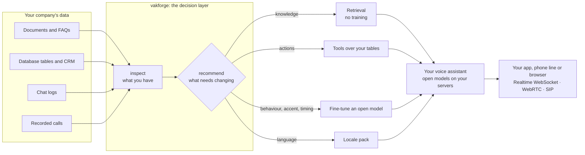
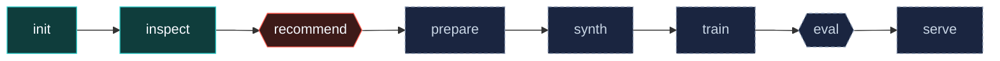
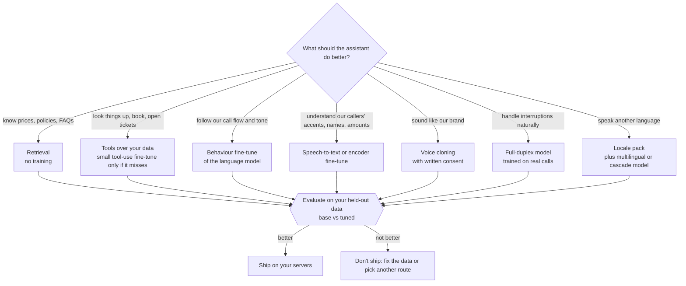

<p align="center">
  
</p>

# vakforge

**The decision layer for open voice AI.** Turn the data your company already has into a self-hosted, real-time voice assistant, and know what actually needs training before you spend anything on GPUs.

Documents, FAQs, database tables, chat logs, CRM records, recorded calls: vakforge works out what your assistant actually needs (knowledge, behaviour, tools, voice, language), generates the conversational data you lack, trains only what needs training, proves the result beats the base model on your own held-out data, and serves it on your hardware behind protocols your clients already speak, starting with the OpenAI Realtime WebSocket format. Open models only, nothing calls a hosted API, any language through locale packs. Launch locales: English (US, UK, India) and Hinglish.

> Status: pre-alpha. See [`docs/ROADMAP.md`](docs/ROADMAP.md) for what exists today.

## Why vakforge exists

Open voice models are good enough today: Moshi, PersonaPlex, LFM2.5-Audio and Qwen-Omni for speech-to-speech, plus strong open speech-to-text and text-to-speech. Yet most companies still pay per minute for a closed voice API. Not because the open models are worse, but because nobody tells them how to use them:

- Should we fine-tune, or is retrieval enough?
- Which model fits our language, our latency and our hardware?
- What data do we need, and are we even allowed to train on our calls?
- How do we prove the result is better before a customer hears it?

vakforge answers those questions from your own data. It inspects what you have, recommends the cheapest fix that works (usually retrieval and tools, not a fine-tune), and gives a coding agent a tested path to build, evaluate and self-host the rest. The hard part was never the models. It was the decision.

> "Open models strengthen safety and cybersecurity, accelerate innovation and diffusion, and enable sovereignty."
> Jensen Huang, NVIDIA, [on X, 24 July 2026](https://finance.yahoo.com/technology/ai/articles/jensen-huang-just-used-first-175154980.html)

vakforge is about the last part: owning your voice AI instead of renting it.

## The problem, for engineers

Open speech-to-speech models exist. Fine-tuning scripts exist for some of them. Evaluation tools exist. Serving frameworks exist. What does not exist is one path from *"here is what my company knows"* to *"here is a voice assistant that handles my workflow, I can prove it is better than the base model, and my existing voice client can talk to it without a rewrite."* Every team rebuilds that path badly, and most of them fine-tune when they should have used retrieval.

## How it works

### Where vakforge fits



### The workflow



Teal: in the CLI today. Coral: next. Dashed: generated per project by your coding agent through the vakforge skill. Hexagons are decision gates: nothing is trained before `recommend` says so, and nothing ships before `eval` shows it beats the base model.

### How the decision is made



The full rules, with data requirements and hardware tiers, are in [`docs/DECISION_GUIDE.md`](docs/DECISION_GUIDE.md).

## What ships

vakforge is three things in one repo:

1. **A core library and CLI** (`pip install vakforge`). Zero ML dependencies. Canonical dataset schema, validator, data inspector, decision engine, locale packs. Runs on a laptop.
2. **An agent skill** (`skill/`). Drop it into Claude Code or any coding agent. The agent reads your data, runs the decision guide, writes the recipe-specific glue for your project, and verifies every upstream API against source before using it. The knowledge lives here; the glue code is generated per project.
3. **Recipes** (`docs/RECIPES.md`). Tested paths from base model to served assistant. Each is an optional extra, isolated because model libraries conflict. Only recipes run end to end get listed.

```
vakforge inspect ./data        ->  what is actually in your documents, tables, chats, audio
vakforge recommend             ->  what needs customizing (often: retrieval, not the model)
vakforge prepare               ->  ingest, transcribe, redact PII, canonical dataset
vakforge synth                 ->  synthetic dialogues in your locale over your tools and facts
vakforge train --recipe X      ->  one tested recipe, not a menu of 400 models
vakforge eval                  ->  base vs tuned: WER, entities, tool calls, latency, voice
vakforge serve                 ->  your open model behind the Realtime protocol; WebRTC and SIP next
```

## Bring any data

| You have | vakforge does |
|---|---|
| Documents, FAQs, SOPs, knowledge base | Retrieval at inference. Facts stay out of weights. Synthetic dialogues grounded in them. |
| Database tables, CRM, product catalogue | Tool definitions over your data, synthetic dialogues that exercise every tool, behaviour fine-tune for reliable tool use. |
| Chat logs, transcripts | Behaviour and workflow fine-tune of the language component; rendered to audio via `synth`. |
| Recorded calls (mono or stereo) | Transcribe, diarize, redact, then everything above plus voice, timing and full-duplex recipes. |
| Nothing yet | Scenario templates in your locale, rendered with open TTS, so you can ship a v0 and collect real data. |

## Locale packs

The pipeline is language-agnostic. Everything language- or market-specific lives in a locale pack: number/currency/date/address formats, PII patterns, privacy-law notes, name generators for synthetic data, preferred models, and a benchmark. See [`docs/LOCALE_PACKS.md`](docs/LOCALE_PACKS.md).

| Pack | Covers | Speech output today | Status |
|---|---|---|---|
| `en` | en-US, en-GB, en-IN | native (all recipes) | launch |
| `hi-Latn` | Hinglish / Roman Hindi, Hindi-English code-switching | English output; Hindi via cascade | launch, the hard-case showcase |
| `zh-CN` | Mandarin | via `qwen-omni` | planned |
| `es`, `de`, `fr`, `pt-BR`, `ja`, `ar` | | via `qwen-omni` or cascade | planned, contributions welcome |

## Recipes

| Recipe | Base model | Good for | Duplex | Hardware (train) | Status |
|---|---|---|---|---|---|
| `lfm25-audio` | LiquidAI LFM2.5-Audio-1.5B | workflow, tool use, style, CPU deploy | turn-based | 1x 24 GB GPU | planned (first) |
| `moshi-lora` | Kyutai Moshi / NVIDIA PersonaPlex | interruptions, natural timing, persona | full-duplex | 1x 40-80 GB GPU | planned |
| `qwen-omni` | Qwen3-Omni | multilingual incl. Mandarin, function calling | near-duplex | 80 GB / multi-GPU | planned |
| `cascade` | STT + LLM LoRA + TTS chosen by locale | any language with a good STT+TTS pair | turn-based | 1x 24 GB GPU | planned |

Details in [`docs/RECIPES.md`](docs/RECIPES.md).

## Serving: open models, standard protocols

"OpenAI Realtime compatible" describes the wire format, not the model. Every recipe serves an open model on your hardware; nothing calls OpenAI or any hosted API. We speak the Realtime WebSocket format first because it is the closest thing voice agents have to a common protocol: teams already on GPT Realtime change one URL, and Pipecat, LiveKit and Twilio integrations work unchanged. Open speech-to-speech models each ship their own ad-hoc protocol, so copying a widely used shape beats inventing another.

The server separates the model backend from the protocol, so more front ends plug in without touching recipes:

| Protocol | For | Status |
|---|---|---|
| OpenAI Realtime WebSocket (documented subset) | teams migrating off GPT Realtime; Pipecat, LiveKit, Twilio clients | first |
| WebRTC via LiveKit or Pipecat transports | browser and mobile apps, lowest latency | next |
| SIP / telephony | call centres and phone lines | next |
| Plain HTTP, one turn per request | batch jobs, simple integrations | planned |
| Gemini Live API format | teams on Google's stack | on request |

## Why launch with English and Hinglish

English is where the strongest open speech-to-speech models are, so every recipe works out of the box for US, UK and Indian English. Hinglish is the stress test: code-switching, Roman vs Devanagari script, Indian names and rupee amounts, noisy phone lines. If the pipeline handles that, a new locale pack is mostly formats and models, not new architecture.

## Quick start (target UX, not all steps implemented yet)

```bash
uv sync
uv run vakforge init my-assistant --locale en-US && cd my-assistant
uv run vakforge inspect ./data
uv run vakforge recommend
```

## Documentation

- [`docs/DECISION_GUIDE.md`](docs/DECISION_GUIDE.md): what actually needs customizing; when not to fine-tune
- [`docs/LOCALE_PACKS.md`](docs/LOCALE_PACKS.md): what a locale pack contains; how to add one
- [`docs/DATA_FORMAT.md`](docs/DATA_FORMAT.md): canonical dataset schema
- [`docs/ARCHITECTURE.md`](docs/ARCHITECTURE.md): package layout
- [`docs/RECIPES.md`](docs/RECIPES.md): per-model training recipes
- [`docs/EVALUATION.md`](docs/EVALUATION.md): metrics, report format, per-locale benchmarks
- [`docs/DATA_ETHICS.md`](docs/DATA_ETHICS.md): consent, PII, licences, privacy law by region
- [`docs/ROADMAP.md`](docs/ROADMAP.md): status
- [`CONTRIBUTING.md`](CONTRIBUTING.md)

## Related projects (we build on these, not against them)

Unsloth, LLaMA-Factory, ms-swift, kyutai-labs/moshi-finetune, NVIDIA PersonaPlex, liquid-audio, Qwen-Omni, Pipecat, LiveKit Agents, vLLM-omni, UltraEval-Audio, AI4Bharat, Common Voice

## Licence

Apache-2.0 for this code. Each recipe's base model has its own licence, see `docs/RECIPES.md`. Datasets you create with vakforge are yours; the consent metadata we require is there to keep it that way.
