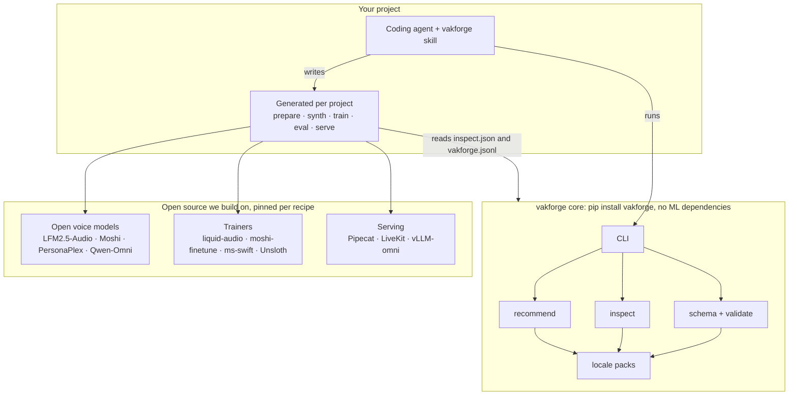
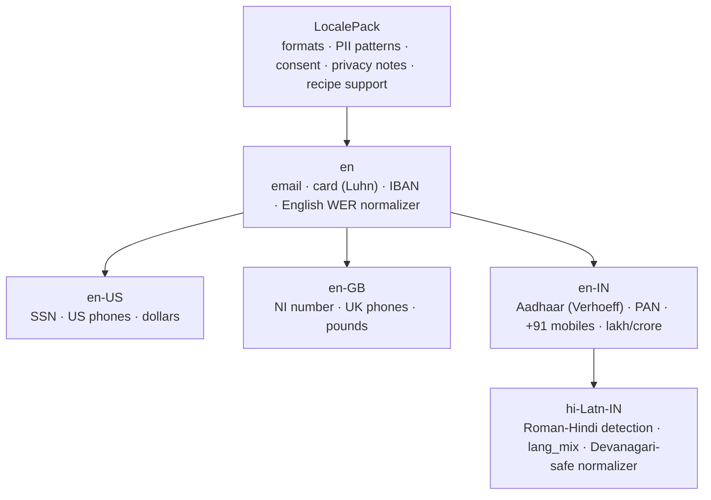
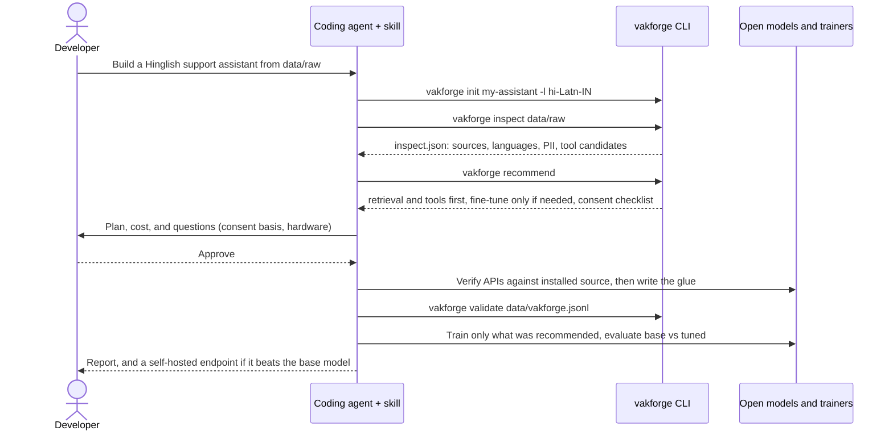
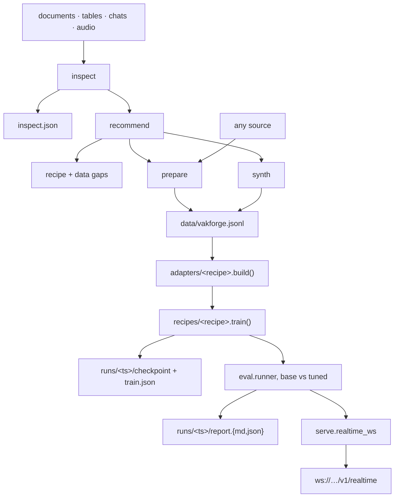

# Architecture

## Principles

1. **One canonical format in the middle.** Raw data → canonical manifest → recipe adapters. Nothing crosses that line sideways.
1b. **Locale packs own everything language- or market-specific.** Core asks the pack; it never branches on a language string.
2. **Core has no ML dependencies.** `schema`, `validate`, `inspect`, `recommend`, `report` import only the standard library, pydantic, numpy, soundfile, rich, typer.
3. **Recipes are plugins.** Each lives in its own package with its own optional extra, lazy imports, and its own integration tests. Adding a recipe never touches core.
4. **Wrap upstream, don't fork.** `moshi-finetune`, `liquid-audio`, Unsloth, NeMo are pinned dependencies called through thin adapters. If an upstream needs a patch, keep it as a `patches/*.patch` applied at install time, and open an upstream PR.
5. **Everything is reproducible from a manifest hash + config file + pinned versions.**

## System view

What vakforge owns, what the coding agent generates per project, and what comes from upstream open source.



## Locale pack inheritance

Children merge language tags and PII patterns from their parent and override scalar settings (`formats`, consent rule, privacy notes).



## An agent run, step by step



## Package layout

Everything below exists today, runs on CPU and imports no ML dependencies.

| Module | What it holds |
|---|---|
| `cli.py` | typer app, one subcommand per stage; thin, delegates everything |
| `config.py` | `vakforge.yaml` loading, pydantic settings, CLI override merge |
| `schema.py` | the canonical models: `Conversation`, `Turn`, `ToolCall`, `Meta`, and the JSON Schema export |
| `validate.py` | the file-level rules from `DATA_FORMAT.md`, returned as structured errors |
| `locales/` | `base.py` pack protocol and registry, `checksums.py`, then one module per pack |
| `inspect/` | `sources.py` classifies, `profile.py` gets per-kind facts, `report.py` summarises the folder |
| `recommend/` | `rules.py`: the decision guide as data, plus the bars and their evidence |

Outside the package: `skill/vakforge/` (the agent skill), `site/` (landing page and these docs),
`examples/` (a synthetic project with its reports), `tests/unit/` (CPU, no downloads).

The stages the skill generates — `prepare`, `synth`, `train`, `eval`, `serve` — are written into
*your* project, not shipped here. `docs/ROADMAP.md` tracks which of them vakforge may ship itself
later; the sections below are the design they would follow.

## Key interfaces

```python
class Adapter(Protocol):
    name: str

    def build(self, manifest: Path, out_dir: Path, cfg: AdapterConfig) -> AdapterOutput: ...

    # AdapterOutput: out_dir, manifest_hash, stats (rows kept/dropped and why)


class Recipe(Protocol):
    name: str
    extra: str  # uv extra that provides deps

    def check_env(self) -> list[EnvIssue]: ...  # missing deps, GPU, gated weights
    def train(self, dataset: AdapterOutput, cfg: TrainConfig) -> TrainResult: ...
    def load_for_eval(self, checkpoint: Path | None) -> Inferencer: ...  # None = base model
    def serve(self, checkpoint: Path | None, cfg: ServeConfig) -> StreamingBackend: ...


class Inferencer(Protocol):
    def respond(self, session: EvalSession) -> EvalTurnResult: ...

    # returns text, audio (24 kHz), tool_calls, timings (ttft, ttfa, total)


class StreamingBackend(Protocol):
    async def append_audio(self, pcm16: bytes) -> None: ...
    async def commit(self) -> None: ...
    async def responses(self) -> AsyncIterator[RealtimeEvent]: ...
    async def tool_result(self, call_id: str, content: dict) -> None: ...
```

None of this is built yet. The point of writing it down now is the constraint it puts on the rest: `eval` and `serve` are to depend on these protocols and nothing else, so that a recipe implementing them gets the full report and every protocol front end without touching either.

## Data flow



## Serving: protocol front ends

The model backend (`StreamingBackend`) knows nothing about the wire. Each protocol is a thin front end in `serve/protocols/` that translates its messages into `append_audio` / `commit` / `responses` / `tool_result`. Every model served is open and local; "OpenAI Realtime compatible" names a message format, not a dependency.

| Front end | Why | Status |
|---|---|---|
| OpenAI Realtime WebSocket | de facto shape for voice agents; GPT Realtime users change one URL; Pipecat, LiveKit, Twilio clients work unchanged | first |
| WebRTC (LiveKit / Pipecat transports) | browsers and mobile, lowest latency, echo cancellation for free | next |
| SIP | telephony, the call-centre use case | next |
| HTTP | one turn per request for batch and simple integrations | planned |
| Gemini Live format | teams on Google's stack | on request |

A new front end ships with its own event list in `serve/README.md` and a contract test against a fake backend.

### OpenAI Realtime WebSocket subset

We implement a documented subset, enough for common clients:

- Client → server: `session.update`, `input_audio_buffer.append`, `input_audio_buffer.commit`, `input_audio_buffer.clear`, `response.create`, `response.cancel`, `conversation.item.create` (for `function_call_output`).
- Server → client: `session.created`, `input_audio_buffer.speech_started/stopped` (VAD), `response.created`, `response.audio.delta`, `response.audio_transcript.delta`, `response.function_call_arguments.done`, `response.done`, `error`.
- Audio: PCM16 24 kHz base64, matching the common default.

Unsupported events return a structured `error` naming the event. The exact list lives in `serve/README.md` and is tested.

## Run directory

```
runs/2026-09-16T10-12-00_lfm25-audio/
  config.yaml            # fully resolved
  manifest_hash.txt
  versions.txt           # pip freeze of the recipe env
  train.log
  checkpoint/            # adapter or full weights
  report.md / report.json
```
